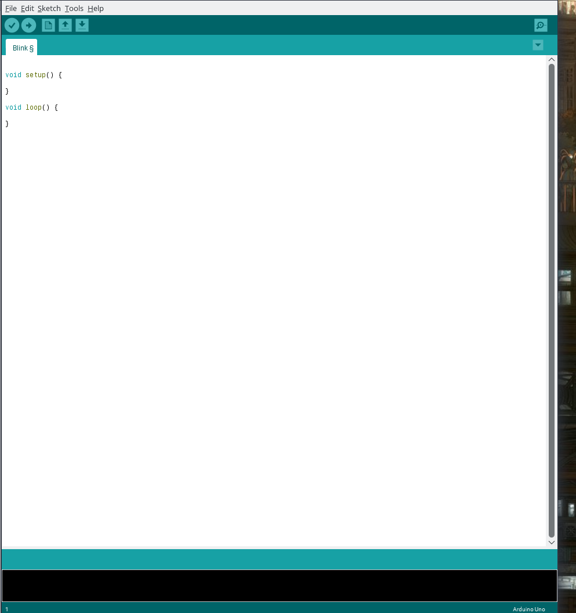

# EmSys Setting up your Lab environment 

Working in the EmSys lab requires you to connect to a specific machine in the Linux lab which has the ESP32 and Logic Analyser attached. 

__See this [list](https://github.com/STFleming/EmSys_labSetup/tree/main/allocations) to find out which machine your group has been allocated to.__ 

First you need to connect to a linux machine via ssh (see section Connecting to your Linux Machine), then you need to setup your environment (see Section Setting up your development environment).

### Connecting to your Linux machine

During the lab sessions you will connect to your allocated Linux machine using ```ssh```. We will also use something called X forwarding to be able to display the GUIs for PulseView, the logic analyser waveform viewer, and to open the Arduino IDE, used for programming your ESP32 device. 

### Connecting via Linux
Connecting to your allocated machine via ssh is easiest from another Linux machine. Simply type in the following:

``` 
    ssh -X -C <USERNAME>@<ALLOCATED MACHINE IP>
```

You should see a bash shell prompt, if in this prompt you type ```arduino``` the GUI for the Arduino IDE should load. You can also type ```pulseview``` in this prompt to load the Logic Analyser GUI.

### Connecting via Windows using VcXsrv
TODO: adding this today

### Connecting via Windows with XMing [[adapted from](https://uisapp2.iu.edu/confluence-prd/pages/viewpage.action?pageId=280461906)]
1. Install the [Xming](http://sourceforge.net/projects/xming/) software
2. Download [Putty.exe](http://the.earth.li/~sgtatham/putty/latest/x86/putty.exe) from the [PuTTY site](http://www.chiark.greenend.org.uk/~sgtatham/putty/).
3. Run Xming on your windows machine to start your local XServer.
4. Run Putty
5. Enter the IP address of your allocated Linux machine (can be found in the [allocation list](https://github.com/STFleming/EmSys_labSetup/tree/main/allocations))
6. Make sure that the connection type is set to SSH
7. Enable X11 forwarding (Connection > SSH > X11)
8. Log in using your username and password (Should have been assigned to your from COSIT)
9. You should now have a bash shell on one of the Linux machines, type ```arduino``` to launch the Ardunio IDE or ```pulseview``` to launch the logic analyser waveform viewer.

### Connecting via Mac [[adapted from](https://uisapp2.iu.edu/confluence-prd/pages/viewpage.action?pageId=280461906)]
1. Install [XQuartz](http://xquartz.macosforge.org/) on your Mac, this is the official XServer for Mac
2. Run Application > Utilities > XQuartz.app
3. Right click on the XQuartx icon in the dock and select Applications > Terminal. This should bring up a new xterm terminal window
4. In this xterm window ssh into your allocated Linux machine with the command. [ [find your allocated machines address here](https://github.com/STFleming/EmSys_labSetup/tree/main/allocations) ] 
``` 
    ssh -X -C <USERNAME>@<ALLOCATED MACHINE IP>
```
5. Once you have a bash prompt type ```arduino``` to open the Arduino IDE, and ```pulseview``` to open the Logic Analyser GUI

## Setting up your development environment

Connect via ssh to your designated Linux machine and type the following into the ssh terminal:
1. clone the setup repository
```
git clone https://github.com/STFleming/EmSys_labSetup.git 
```
2. Navigate into the EmSys_labSetup directory
```
cd EmSys_labSetup
```
3. run the setup script -- will take a few minutes so have a cup of tea
```
./setup.sh
```

Once those have completed then log out and log back in again (remember to have X-fowarding on when you log back in -X -C). To test out your environment type in ```arduino```. The Arduino IDE should load and look like the following.



Make sure you can select the correct board in the Arduino IDE. Go to:

```
Tools -> Boards -> ESP32 Arduino -> TinyPico
```

-----------------------------------------

And you should now be ready to go!


### FAQ
* I keep getting ``Unknown cipher type ...`` error? 
> Make sure that you are using capitals for the ssh flags, i.e. use "-X -C" not "-x -c"

