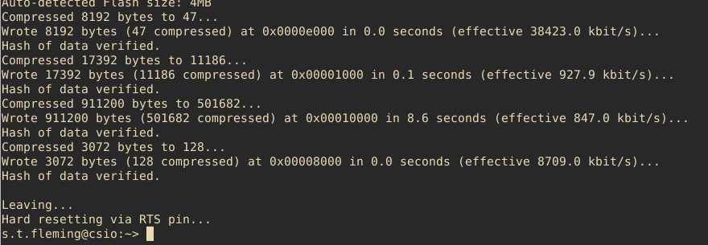
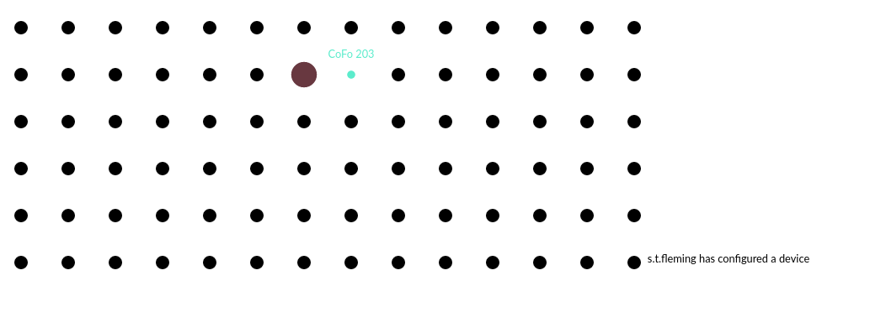

# EmSys Setting up your Lab environment (Take 2) 

Working in the EmSys lab requires you to connect to a specific machine in the Linux lab which has the ESP32 and Logic Analyser attached. 

__See this [list](https://github.com/STFleming/EmSys_labSetup/tree/main/allocations) to find out which machine your group has been allocated to.__ 

There are five parts to this guide:
1. Connecting to your Lab Machine (Windows/Linux/Mac)
2. Setting up your environment
3. Transfering a sketch from your machine to your Linux lab machine 
4. Compiling and uploading your first TinyPico program 
5. Looking at the serial output of your TinyPico device

Each step must be completed in order.

-----------------------------------------------------

## Connecting to your setup

Below is a list of video guides for connecting to your device on various platforms.

| Platform | Video Guide URL          |
|----------|--------------------------|
| Windows  | [video](www.youtube.com) |
| Mac      | [video](www.youtube.com) |
| Linux    | [video](https://youtu.be/J5JkNLIkNDY) |

__Guide for Linux / Mac__
Open a terminal and type in the following
``` 
        ssh <YOUR STUDENT ID>@<ALLOCATED MACHINE>
```

You will be presented with a bash shell running on your Linux machine.

__Guide for Windows__


1. In the ``Host Name (or IP address)`` put the address of your groups allocated machine.

------------------------------

## Development environment setup

[[Video on setting up your development environment](https://youtu.be/ucdD1zjaWeg)]

Copy and paste the following command into your ssh terminal and execute it (hit enter).

__WARNING__: This command attempts to clean up some of the mess created by the last lab, you should ensure than any code you wrote in the previous lab session is backed up. In particular this script will remove the following folders in your Linux home directory: ``~/Arduino``, ``~/.arduino15``, ``~/EmSys_labSetup``.  


```
curl -o- https://raw.githubusercontent.com/STFleming/EmSys_labSetup/main/setup.sh | bash -

```
If successful the output should look like the image below, showing that a program has been successfully written into the flash memory of the TinyPico, and that the device has been reset.



Then navigate to the EmSys virtual labpage: [http://ec2-18-222-206-236.us-east-2.compute.amazonaws.com:4000/](http://ec2-18-222-206-236.us-east-2.compute.amazonaws.com:4000/)

You should see a message printed that your username has successfully configured a device. This means that your device was programmed and was able to connect to the wider network in the lab.



*Note: this last step where you see the message on the virtual lab-server isn't the most reliable, so don't panic if it doesn't show up*

--------------------------------

## Transfering a sketch from your machine to your Linux lab machine 

Unless you are comfortable with command-line based text editors, such as vim, my advice would be to edit your TinyPico programs on your home machine and transport the relevant files across to the Linux lab machines.

I have created a video explaining this process for several platforms.

| Platform | Video Guide URL          |
|----------|--------------------------|
| Windows  | [video](www.youtube.com) |
| Mac      | [video](www.youtube.com) |
| Linux    | [video](https://youtu.be/yt0RVEX1274) |

## Compiling and uploading your first TinyPico program 

[[video guide on how to compile and upload your HelloWorld program to your TinyPico](https://youtu.be/uddiqhSN3Ks)]
